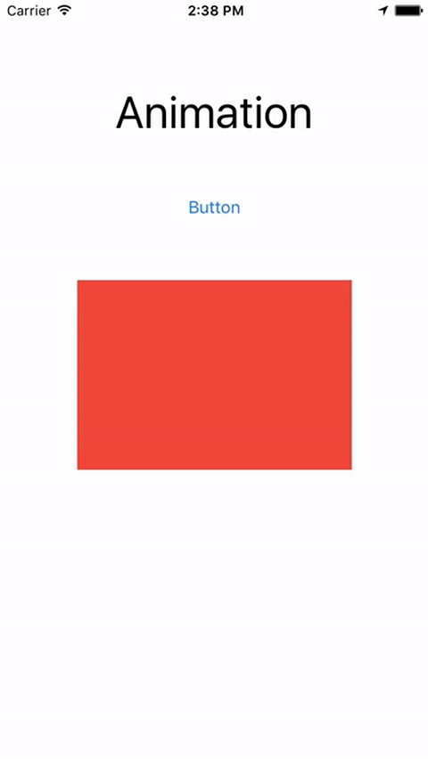
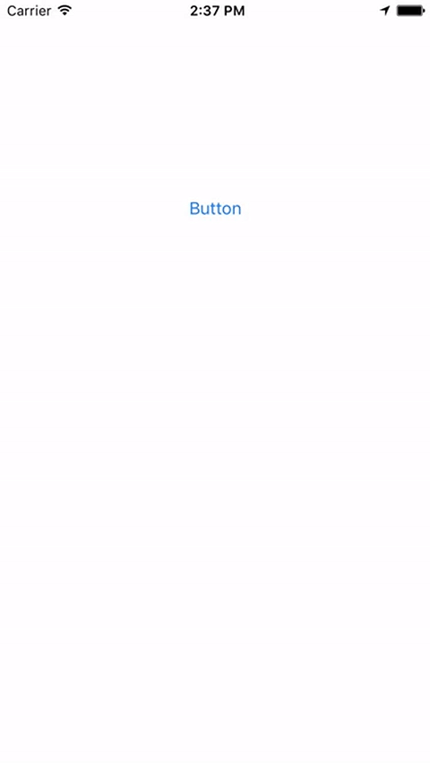

# Animation-Extension

This example shows how to animate elements in your view controllers. The example makes use of an extension to 
UIViewController to simplify the process. The extension has a single method that allows you to animate: 

* x
* y
* alpha

It provides options for:

* time 
* delay

The values set the offset for view elements. Imagine that the values move an element by the amounts provided, and the
element moves back to it's original position. This system is not able to complex animation but would be good for 
adding motion to views as they load, or other simple UI aniamtions. 

## Usage

Plan your views with all objects positioned where you want them to be when the animation is completed. Call animate thing with offset values for x, y, and alpha, include the time the motion should take, the amount of time to delay before starting, and the object to move. 

Here is an example:

    animateThing(self.label,    offsetX: 0,   offsetY: 120,     alpha: 1,  time: 1, delay: 1.4)
    animateThing(self.button,   offsetX: 0,   offsetY: 200,     alpha: 1,  time: 1, delay: 0)
    animateThing(self.box,      offsetX: 400,     offsetY: 0,   alpha: 0,  time: 1, delay: 2.0)

Imagine your view starts like this: 

The values in the example code above move the label up 120 (offsetY: 120), the button up 200 (offsetY: 200), and the box 400 points to the right (offsetX: 400). 

